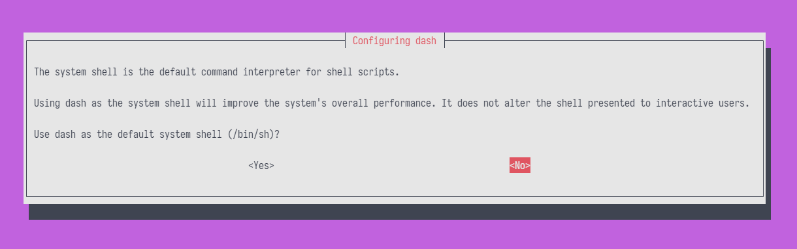

# Ubuntu 切换默认 sh


<!--more-->

## 查看

查看 sh 路径

```shell
which sh
```

```text
/usr/bin/sh
```

查看默认 sh

```shell
ll /usr/bin/sh
```

```text
lrwxrwxrwx 1 root root 4 Feb 16 21:03 /usr/bin/sh -> dash*
```

## 切换

```shell
sudo dpkg-reconfigure dash
```



- 选择 [是] 设置 sh 为 dash
- 选择 [否] 设置 sh 为 bash

查看 sh：

```shell
ll /usr/bin/sh
```

```text
lrwxrwxrwx 1 root root 4 Feb 16 21:03 /usr/bin/sh -> bash*
```

